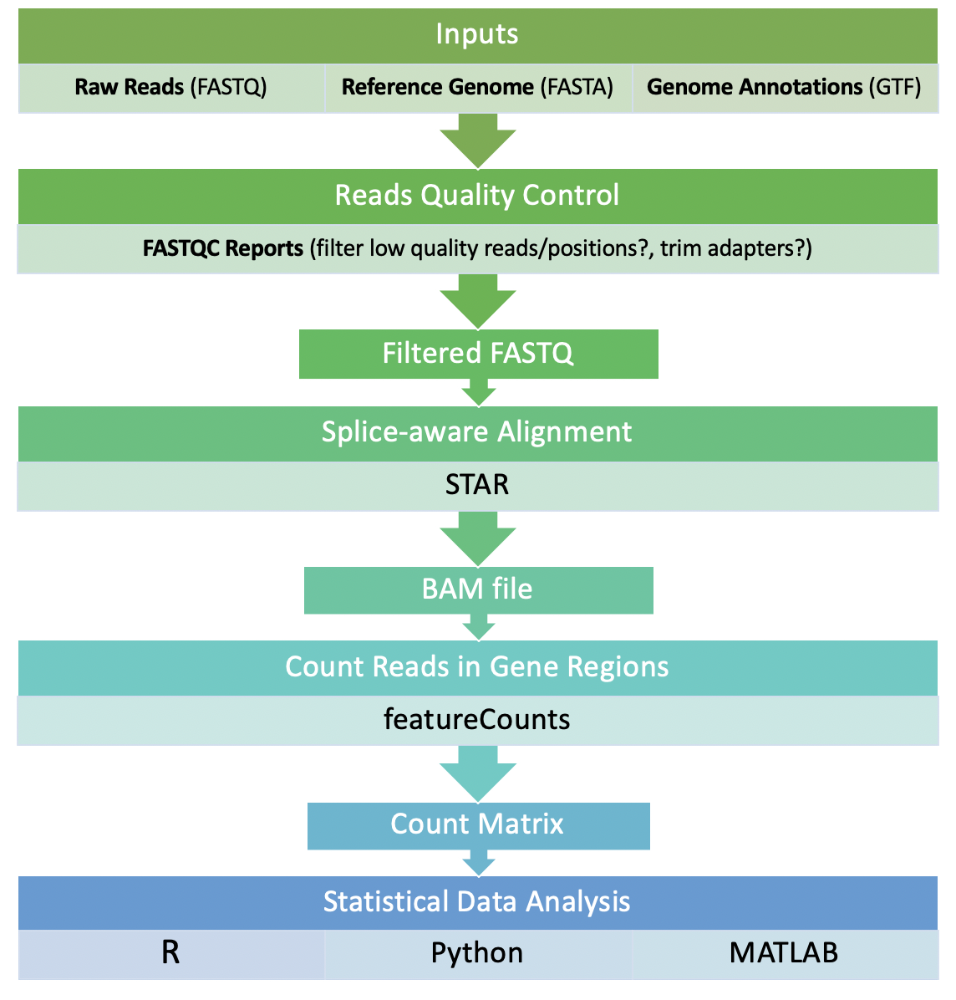

```{r setup, include=FALSE}
knitr::opts_chunk$set(echo = TRUE)
```

# Getting started

We will be performing preprocessing of RNA-seq data in a Linux environment on the RCC computing cluster. The figure below shows the general outline of RNA-seq processing pipeline. Note that the pipeline can differ depending on the sequencing platform, the format of the raw reads, and the overall goal of the project. In our case, we simply want to process Illumina-based RNA-seq reads into an expression matrix, which contains the read counts of each gene in each sample. 

<p align="center">

</p>

Get started by using `ssh` to log into `midway`. 

```{bash,eval=F}
ssh CNETID@midway2.rcc.uchicago.edu
```

Once logged in successfully, move to your scratch directory. Then, make a folder called `Lab2` and go into it.

```{bash,eval=F}

cd /scratch/midway2/CNETID

mkdir Lab2

cd Lab2

```

**Please run all commands while in your `Lab2` folder! You will get errors otherwise!**

The raw data can be found in the class directory. You do not need to go into the class directory. We will be processing RNA-seq samples from 10 lymphoblastoid cell lines derived from unrelated Nigerian individuals (Pickrell et al. 2010.) You can view the FASTQ files by typing:

```{bash, eval=F}
ls /project2/bios26121/Lab2_RNAseq_Processing/unmapped_reads/
```

```{bash, eval=F}
NA18504_argonne.fastq.gz  NA18519_argonne.fastq.gz  NA18856_argonne.fastq.gz  NA19099_argonne.fastq.gz  NA19116_argonne.fastq.gz
NA18510_argonne.fastq.gz  NA18852_argonne.fastq.gz  NA19093_argonne.fastq.gz  NA19102_argonne.fastq.gz  NA19140_argonne.fastq.gz
```

The raw reads are in [FASTQ](https://en.wikipedia.org/wiki/FASTQ_format) format with 46 bp single-end reads. The FASTQ files are compressed by `gzip` to save disk storage, thus the files have a `.gz` extension. It's not important to know how this works but its **important to know how to read the contents of a zipped folder without unzipping it**. In Linux, `zcat` is used to read text files that are zipped, similar to how `cat` is used to read unzipped text files. We can view a few entries in a FASTQ file in the following way:

```{bash,eval=F}
zcat /project2/bios26121/Lab2_RNAseq_Processing/unmapped_reads/NA18856_argonne.fastq.gz | head -n 4
```

The output should look like this:

```{bash, eval=F}
@HWI-EAS146:1:5:17:1659#0/1                               # READ NAME
CCCCCCCCCCCCCCCCCCCCCCCCCCCCCCCCCCCCCCCCCCACCC            # SEQUENCE
+                                                         # DESCRIPTION (optional)
BBB@1@>B?AABBBBBBBBABAAB>=A=BBBA9@7@>/@3A<)<5@            # BASE QUALITY SCORES
```

# FASTQ Quality Control

We would like to assess the quality of the reads before moving to alignment. We will use a popular tool called FASTQC, which compiles a detailed report about the FASTQ files. Note that FASTQC (and most softwares) takes zipped directly as input, so theres no need to unzip them beforehand. FASTQC will genetate one report per FASTQ file, and requires manual inspection of the report. We have 10 fastq files, therefore inspecting each manually is managable. Projects with hundreds of FASTQC reports use tools such as `MultiQC` to aggregate the reports. We will simply inspect them manually. 

To run FASTQC, start by copying the sbatch script for FASTQC into your scratch directory:

```{bash, eval=F}
cp /project2/bios26121/Lab2_RNAseq_Processing/fastqc.sbatch .
```

To view the contents of the script, type:

```{bash, eval=F}
cat fastqc.sbatch
```

```{bash, eval=F}
#!/bin/bash

#SBATCH --job-name=fastqc
#SBATCH --output=fastqc_log
#SBATCH --error=fastqc_errors
#SBATCH --time=12:00:00
#SBATCH --nodes=1
#SBATCH --ntasks=1
#SBATCH --mem-per-cpu=20000
#SBATCH --account=bios26121
#SBATCH --partition=broadwl

module load fastqc

FASTQ_FILES=$(ls /project2/bios26121/Lab2_RNAseq_Processing/unmapped_reads/*)
OUT_DIR='fastqc_results'

mkdir $OUT_DIR

fastqc $FASTQ_FILES \
       --out $OUT_DIR
```

Lines that begin with '#' are for the RCC system, and lines without are for running our FASTQC commands. You can read more about submitting jobs to the RCC [here](https://rcc.uchicago.edu/docs/using-midway/index.html#batch-jobs).

Type the following command to submit the FASTQC job:

```{bash,eval=F}
sbatch fastqc.sbatch
```

To check the status of the job, type:

```{bash,eval=F}
qstat -u CNETID
```

If the job is running smoothly, the `Use` status will be `R` (Running). If the job encounters an error or is fininished, it will display `C` (Canceled). 

```{bash,eval=F}
                                                                               Req'd  Req'd   Elap
Job id               Username Queue    Name                 SessID NDS   TSK   Memory Time Use S Time
-------------------- -------- -------- -------------------- ------ ----- ----- ------ ----- - -----
56523402             CNETID   broadwl  fastqc               --         1     1     -- 12:00 R 00:00
```

If for any reason the job fails, you can check `fastq_errors` file (in the same directory) for error messages. This should take ~5 minutes to complete.

The script above will generate a directory called `fastqc_results` in your scratch directory. In it, there are two files per FASTQ: `SAMPLE_NAME_fastqc.html` and `SAMPLE_NAME_fastqc.zip`. The HTML file contains all the test metrics and the .zip file contains the content needed to recreate the HTML file.

To view the HTML reports, we will need to download them to our computes. Open a *new* terminal tab, and use the secure copy function `scp` to download them (for Mac users)

```{bash,eval=F}
CNETID='X'
scp -r $CNETID@midway2.rcc.uchicago.edu:/scratch/midway2/$CNETID/fastqc_results/ ~/
```

Replace 'X' with your CNET ID. The command above will download the folder to your home directory on YOUR laptop (not the server). Enter password and authenticate to complete download. 

If you are a Windows user, follow the steps here to download using [WinSCP][https://research.computing.yale.edu/support/hpc/user-manual/transfer-files-or-cluster]. 

Double click the .html file to open it in your browser. The left panel indicates all the tests that FASTQC ran. A green icon indicates a pass, orange is a warning, and red is a failure. 

The most important catagories to look out for are "per sequence quality scores" and "per base sequence quality". If these are poor metrics, we would have to trim low quality positions, and filter low quality reads. At the minimum, all samples should at least pass the "per sequence quality scores" (a warning is fine) before moving onto alignment, i.e. no reads with failing quality scores. Check all 10 reports to see if this is the case and then move on to the next section. You can learn more about all the other tests  [here](http://www.bioinformatics.babraham.ac.uk/projects/fastqc/Help/3%20Analysis%20Modules/). 
 
# Alignment

We will now align the reads. We will be using the [STAR](https://www.ncbi.nlm.nih.gov/pmc/articles/PMC3530905/) aligner to align our reads to the human reference genome hg38. STAR is a splice-junction-aware aligner, meaning it can map spliced mRNA (which doesn't contain introns) across a genomic region with introns. 

Once again, to run STAR, start by copying the sbatch script for STAR into your scratch directory:

```{bash, eval=F}
cp /project2/bios26121/Lab2_RNAseq_Processing/align_reads.sbatch .
```

View contents:

```{bash,eval=F}
cat align_reads.sbatch
```

```{bash,eval=F}
#!/bin/bash

#SBATCH --job-name=STAR_align
#SBATCH --output=STAR_log
#SBATCH --error=STAR_errors
#SBATCH --time=12:00:00
#SBATCH --nodes=1
#SBATCH --ntasks=10
#SBATCH --mem-per-cpu=4000
#SBATCH --account=bios26121
#SBATCH --partition=bigmem2

module load STAR

STAR_REF_INDEX='/project2/bios26121/Lab2_RNAseq_Processing/refGenome/STAR/'
FASTQ_FILES=$(ls /project2/bios26121/Lab2_RNAseq_Processing/unmapped_reads/* | paste -sd,)
READ_GROUP_IDs=$(ls /project2/bios26121/Lab2_RNAseq_Processing/unmapped_reads | cut -d'_' -f1 | awk '{print " ID:"$1" "}' | paste -sd,)
OUT_DIR='BAM_files'

mkdir $OUT_DIR

STAR --runThreadN 10 \
     --genomeDir $STAR_REF_INDEX \
     --readFilesIn $FASTQ_FILES \
     --readFilesCommand zcat \
     --outFilterMultimapNmax 100 \
     --outSAMtype BAM SortedByCoordinate \
     --outSAMattrRGline $READ_GROUP_IDs \
     --outFileNamePrefix $OUT_DIR/
```

Submit the sbatch script:

```{bash, eval=F}
sbatch align_reads.sbatch
```

This should take ~5 mins to complete. The output is stored at `BAM_files/Aligned.sortedByCoord.out.bam`. The output is a *S*equence *A*lignment *M*ap [SAM](https://en.wikipedia.org/wiki/SAM_(file_format)) file. It stores mapping information for each read, such as the mapping position, and the reference sequence onto which the read maps on. To further compress the SAM file and save, we convert it to a *BAM* file, which is a *B*inary SAM file. We also sorted the reads in the BAM file by their genomic coordinates (i.e. reads mapped in chromosome 1 are on top, and so forth), which is useful for downstream analyses.

We can view the contents of the BAM file using `samtools`. `samtools` is very handy for manipulating BAM files. You can find a list of frequently used `samtools` commands [here](http://www.htslib.org/doc/samtools.html).  We will use `view` to read simply view the contents of the BAM file:

```{bash, eval=F}
module load samtools

samtools view BAM_files/Aligned.sortedByCoord.out.bam | head -n 1
```

```{bash, eval=F}
HWI-EAS146:7:40:26:1960	0	chr10	21457	255	9S37M	*	0	0	AAAAAAAGAGAAAAAAAAAAAAAAAAAAAAAAAAAAAAAACAAGAA	%%%%%%%%%%%%%%%%%%%%%%%%%%%%%%%%%%%%%%%%%%%%%%	NH:i:1	HI:i:1	AS:i:36	nM:i:0	RG:Z:NA19102
```

The important columns are the third and fourth columns, which represent the chromosome name and the starting position of where the read maps to. The fifth column is also important because it shows the read mapping quality (here it is the maximum, 255, which indicates a perfect alignment.) It is common at this stage to filter low quality alignments by setting a threshold on the fifth column, but I will skip this step here for simplificity. There are tags as well that can show a variety of metadata about the read. For instance, the `RG` tag shows that this read is from individual `NA19102`.

# Assign features

Now that the reads are aligned to genomic coordinates, we want to know which genes these reads mapped to. We will use `featureCounts` to count the number of reads that were mapped to each gene using an *annotation* file. The annotation file provides a description (length, gene name, etc.) to genomic regions, and featureCounts creates a tally of reads that were mapped in each genomic region.

To run featureCounts, copy the sbatch script for featureCounts into your scratch directory:

```{bash,eval=F}
cp /project2/bios26121/Lab2_RNAseq_Processing/featurecounts.sbatch .
```

```{bash,eval=F}
cat featurecounts.sbatch
```

```{bash, eval=F}
#!/bin/bash

#SBATCH --job-name=featureCounts
#SBATCH --output=featureCounts_log
#SBATCH --error=featureCounts_error
#SBATCH --time=12:00:00
#SBATCH --nodes=1
#SBATCH --ntasks=1
#SBATCH --account=bios26121
#SBATCH --partition=broadwl

ANNOTATIONS='/project2/bios26121/Lab2_RNAseq_Processing/refGenome/gencode.v27.annotation.gtf'
BAMFILE='BAM_files/Aligned.sortedByCoord.out.bam'
FEATURECOUNTS='/project2/bios26121/Lab2_RNAseq_Processing/software/featureCounts'
OUT_DIR='counts/'

mkdir $OUT_DIR

$FEATURECOUNTS -a $ANNOTATIONS \
               -o $OUT_DIR/counts.txt \
               -t gene \
               --byReadGroup \
               $BAMFILE

cut -f1,7-18 $OUT_DIR/counts.txt | sed 's/BAM_files\/Aligned.sortedByCoord.out.bam://g' | grep -v "#" > $OUT_DIR/count_matrix.txt
```

Submit:

```{r,eval=F}
sbatch featurecounts.sbatch
```

This should take ~1 minute to complete.

The script above does two things: 

1) It calls the program `featureCounts` and returns `counts.txt`, which contains the read counts of each gene in each sample, as well as other metadata. We aren't too interested in the metadata at this stage, which brings us to the next postprocessing step. 

2) I used `cut` on the previou output `counts.txt` to keeps column 1 (the gene IDs) and columns 7-18 which contain the count information for all samples. I also used `sed` to remove un-needed text from the headers. The final output is a clean gene count matrix called `count_matrix.txt`. 

Check your output by viewing the head of the count matrix:

```{bash,eval=F}
head -n 5 counts/count_matrix.txt
```

It should look like this:

```{bash,eval=F}
Geneid	NA18504	NA18510	NA18519	NA18852	NA18856	NA19093	NA19099	NA19102	NA19116	NA19140
ENSG00000223972.5	0	0	0	0	0	0	0	0	0	0
ENSG00000227232.5	6	23	2	14	1	8	6	1	22	28
ENSG00000278267.1	0	0	0	0	0	0	0	0	0	0
ENSG00000243485.5	0	0	0	0	0	0	0	0	0	0
```

# Exercises

### 1. **FastQC Reports** 

We generated 10 quality control (QC) reports in the first section of this tutorial. Have a look at the "Per base sequence quality" in each report. This section reports the sequencing quality (y-axis) as a function of position in each read (x-axis). 

* What can you say about the average quality as a function of base position? Hint: It is a problem associated with Illumina reads that we discussed in class. 
* What would you do (using bioinformatics) to alleviate this problem?

### 2. **Alignment** 

We performed alignment in the second section but we did not discuss the quality of the alignment. STAR returns a log file called `Log.final.out` which has important statistics that we must consider. View the contents of this file and report the following:

* Total number of input reads
* Percentage of reads that are uniquely mapped
* Percentage of reads that are mapped to multiple loci
* Percentage of reads unmapped

### 3. **Multimapped Reads**

The alignment statistics from #2 show the number of multimapped reads, which are reads that mapped equally well across multiple loci in the genome. Multi-mapped reads are generally not useful for downstream analyses but they are an important quality control metric for alignment. We can discard multi-mapped reads from our final BAM file by setting an upper bound (maximum) on the number of loci that a read maps to. In the STAR command, this filtering is achieved by the `--outFilterMultimapNmax` parameter. Using a value of `1` will keep only uniquely mapped reads, i.e. single loci. In the tutorial, we used a value of `100` to effectively keep all multimapped reads. 

a) Edit the STAR sbatch file and change the `outFilterMultimapNmax` parameter to **5**. Rerun the alignment and report the percentage of reads that are mapped to multiple loci in `Log.out.final`. Repeat for parameter values of **10, 15, 20**, each time reporting the percentage of multi-mapped reads. 

b) For multi-mapped reads, how many loci do most reads map to? Give a range based on the values from a).

c) How can one reduce the multi-mapping rate experimentally? i.e. have more unique mapping?

### 4. **Library size** 

Download the final gene count matrix `count_matrix.txt` to your computer by typing the following `scp` command on your laptop terminal:

```{bash,eval=F}
CNETID='X'
scp $CNETID@midway2.rcc.uchicago.edu:/scratch/midway2/$CNETID/counts/count_matrix.txt ~/
```

Open RStudio, and load the count matrix into R using the code below:

```{bash,eval=F}
counts <- read.delim('~/count_matrix.txt',sep='\t', row.names=1, header = T)
```

View the head of the matrix using:

```{bash, eval=F}
head(counts)
```

The row names of the matrix `counts` represent gene IDs, while the column names represent samples.

Consider the gene _GAPDH_, which is a well-known housekeeping gene with functions in glycolysis. _GAPDH_ is commonly used a control in RNA-seq studies because its expression should more-or-less be constant across samples. If it's not constant, then the reason is likely technical rather than biological. We can use the expression of _GAPDH_ to test for technical variability in gene expression. One common technical variability is the library size, which is the total number of reads in each sample.

You can approximate the library size of each sample by using the `colSums()` function:

```{bash,eval=F}
lib_size <- colSums(counts)
```

* Plot the the expression of _GAPDH_ (gene ID: ENSG00000111640.14) against the library size in each sample. Report the plot. 
* What is the relationship between these two variables? Fit a linear model and report the $R^2$ statistic. 
* What would you do to fix this? (Give your best guess; we will learn about normalization next week.)


